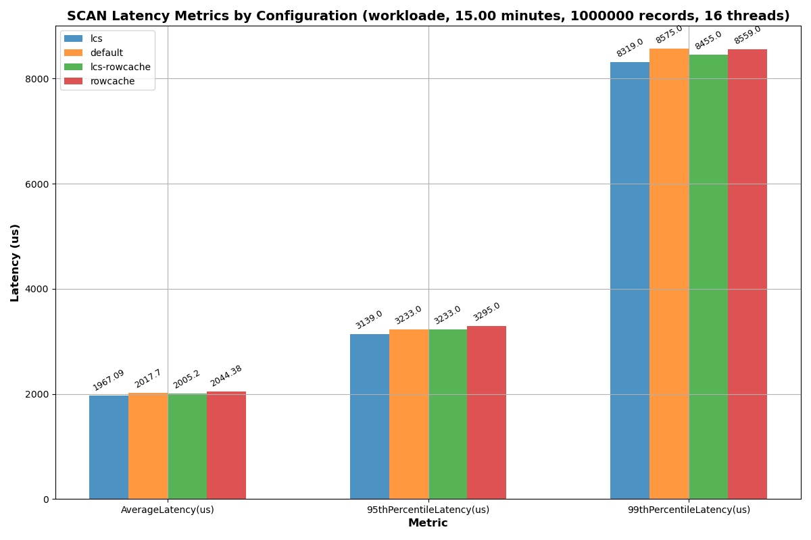
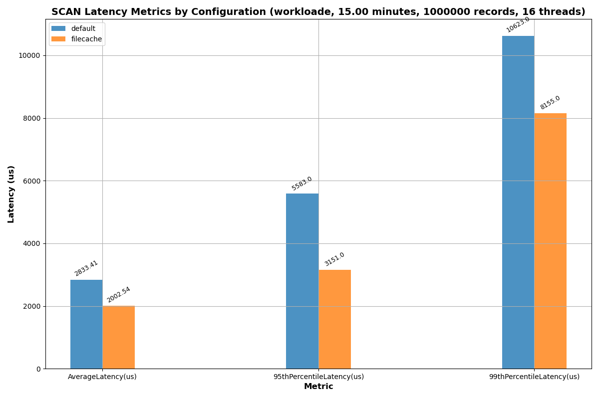
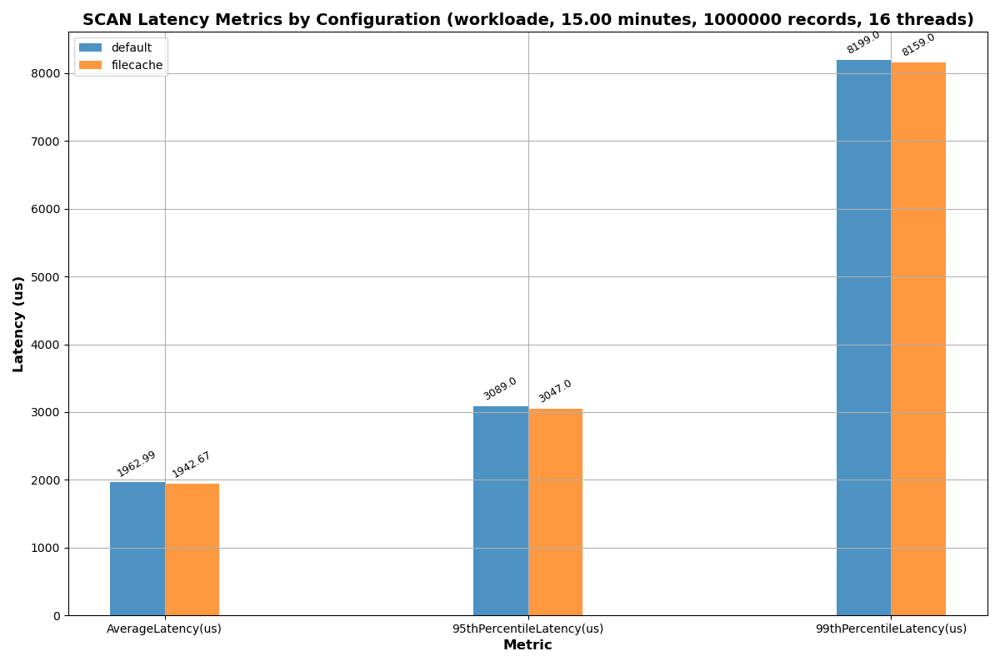
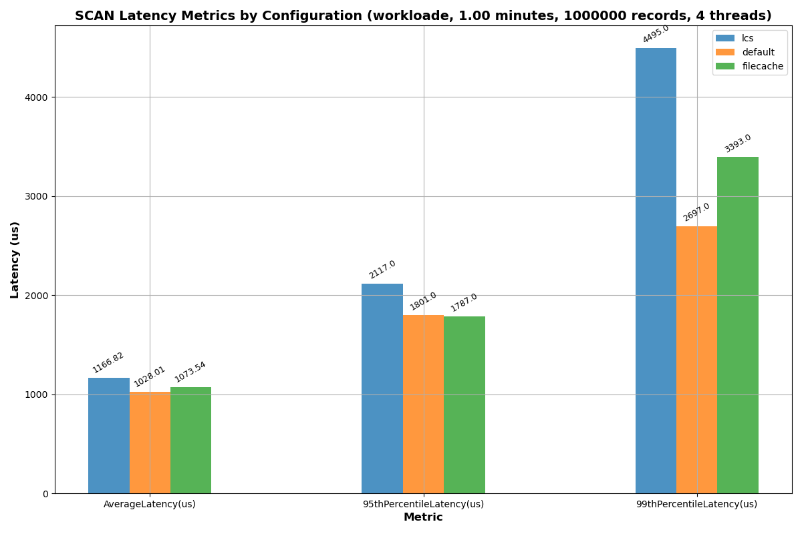
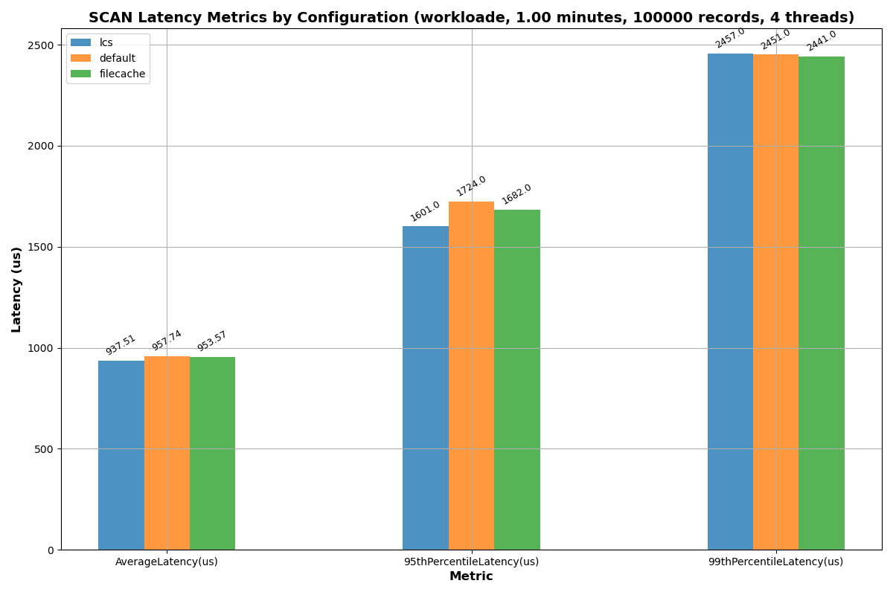
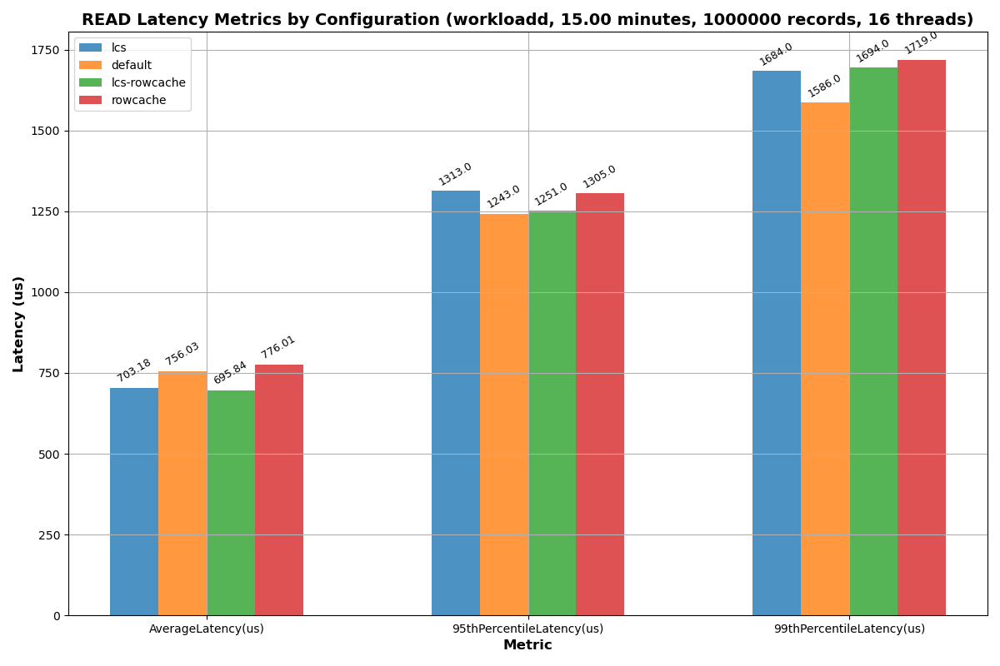

# SCAN profiling (workload e)
I compared the benchmarks of several configurations for the SCAN operation:
- Default
- Use LCS (leveled compaction strategy)
- Use row cache
- Use both LCS and row cache

For the row cache, I set the limit to 10 GB, and cache all rows per partition. I used the default scan size of 100 records and used 16 threads for YCSB.

Here is the setup that I used:
- 1 node cluster in Docker container
- Apache Cassandra 3.11.17 release
- 16 GB RAM
- 8 CPUs
- 4 GB heap
- 512 GB SSD

I ran the benchmark on `workloade` which has a 95:5 SCAN to INSERT ratio and a request distribution of zipfian, and set the number of operations to the max and ran for 15 minutes. I ran the benchmark workflow for each of the 4 configurations, with 1000000 records, profiling the SCAN operation for workload e using: 
```
chmod +x run_workflow.sh
./run_workflow.sh -c default 900 SCAN workloade 1000000 16
./run_workflow.sh -c rowcache 900 SCAN workloade 1000000 16
./run_workflow.sh -c lcs 900 SCAN workloade 1000000 16
./run_workflow.sh -c lcs-rowcache 900 SCAN workloade 1000000 16
```

## Results
Below are the plots of the results I got for the benchmarks for both 1 million records.




For 1 million records, it seems as if utilizing LCS provided a very negligible improvement in latency and throughput. All other configurations didn't provide much improvement, or worsened latency and throughput.

### Discussion
The row cache in cassandra is ideal for point queries that randomly access by key, or read operations that often read the same rows. Thus, row caching is not optimized for sequential scan operations. I ran `node exec -it cassandra nodetool info` several times, and noticed that the rowcache had 0% utilization and 0% hit rate despite being enabled and having the 10 GB allocated. Based on what I've read, scan operations do not populate the row cache.

LCS organizes data into levels where each level contains non-overlapping SSTables. Each subsequent level is several times larger than the previous one. Most reads can be satisfied by searching only a few levels, typically starting from the smallest level. LCS theoretically and in practice should improve the number of SSTables touched during random reads. However if the scans spanned across multiple partitions of cross SSTables, using LCS may not improve performance like in this case.

# Follow up: file cache
The file cache is used to cache blocks of data from sstables to reduce necessary disk I/O. We set the file cache size to 10 GB. This sounds like it would help our SCANs if all or all frequently used sstables are cached. Also note that the filecache (chunk cache) is already on by default, but the size is smaller. We run this on workload e again with 1 million records:

```
chmod +x run_workflow.sh
./run_workflow.sh -c default 900 SCAN workloade 1000000 16
./run_workflow.sh -c filecache 900 SCAN workloade 1000000 16
```

## Results
I ran the benchmark twice and the latency results were below:



In the first run, enabling the filecache significantly reduced latency, but on the second run the default configuration did better and latency was about the same.

### Discussion
In theory, with enough memory, the file cache should significantly save I/O for scan operations and reduce latency. 

With the file cache set to 10 GB, storing all records, running `docker exec -t nodetool info` mid-run gives:
```
Chunk Cache: entries 17827, size 1.09 GiB, capacity 9.73 GiB, 68698 misses, 13287312 requests, 0.995 recent hit rate, 60.625 microseconds miss latency
```

With the file cache at the default settings, running the same mid-run gives:
```
Chunk Cache: entries 7680, size 480 MiB, capacity 480 MiB, 712339 misses, 4251094 requests, 0.832 recent hit rate, 28.989 microseconds miss latency
```

The chunk cache has a 99.5% hit rate when increased to store all records. With the default settings, the hit rate is about 83.2%. This is still decent. Knowing that the hit rate is nearly perfect with a higher chunk cache, the latency and throughput should improve, but there is likely some other system bottleneck causing no performance increase.

I noticed that with 16 threads working, the CPU utilization would sometimes hit over 800% for the 8 cores I have. I ran a sanity check to ensure the bottleneck wasn't CPU or disk space by running similar tests with less records with less threads for just 1 minute, and the results below indicate that neither CPU nor memory limits are the problem.




I also considered whether increasing the workload to 2 million records so using a larger file cache would keep a high cache hit ratio while the default would have a lower cache hit ratio, since I wanted to see if the file cache would benefit a higher load. I didn't run this for the full 15 minutes, but based on my tests, running with the same configurations for 1 vs 15 minutes didn't change the latency or throughput per second as long as the hardware could support it. There were no latency or throughput improvements:


# Follow up: READ profiling with workload d
Since the row cache is meant for random reads and it did not yield improvements for the SCAN heavy workload, I ran `workloadd` which has a 95:5 READ to INSERT ratio and a request distribution of latest, and set the number of operations to the max and ran for 15 minutes:
```
chmod +x run_workflow.sh
./run_workflow.sh -c default 900 READ workloadd 1000000 16
./run_workflow.sh -c rowcache READ SCAN workloadd 1000000 16
./run_workflow.sh -c lcs 900 READ workloadd 1000000 16
./run_workflow.sh -c lcs-rowcache 900 READ workloadd 1000000 16
```

## Results
Below are the plots of the results I got for the benchmark.




From the results it seems using LCS compaction improves throughput by a tiny bit, but worsens latency by a tiny bit. Using the row cache seems to decrease throughput a bit and increase latency a bit.

### Discussion
In workload d, the request distribution is set to latest. Thus, recent records being read are likely still in the memtable which is why using the row cache did not improve throughput or performance since it didn't help reduce disk I/O. 

If reads were served from in memory memtables, using LCS wouldn't have improved our performance.

# Follow up: READ profiling (workload c)
Since the request distribution of latest didn't seem to be fit for LCS or row caching, I ran the benchmark on `workloadc` which has a 100% READ ratio and a request distribution of zipfian, and set the number of operations to the max and ran for 15 minutes:

```
chmod +x run_workflow.sh
./run_workflow.sh -c default 900 READ workloadc 1000000 16
./run_workflow.sh -c rowcache 900 READ workloadc 1000000 16
./run_workflow.sh -c lcs 900 READ workloadc 1000000 16
./run_workflow.sh -c lcs-rowcache 900 READ workloadc 1000000 16
```

### Results
Below are the results I got from the benchmark:


From the results it seems using LCS compaction improves both throughput and latency a good chunk (around 15-20% on average). 

However, I was very surprised to see that enabling the row cache worsened throughput, as well as average latency. I made sure the row cache was working by running `docker exec -it nodetool info`, and it indicated that that cache hit ratio was around 90% so queries were definitely not hitting disk. 
```
Row Cache : entries 999314, size 1.19 GiB, capacity 9.77 GiB, 14910802 hits, 15910116 requests, 0.937 recent hit rate, 0 save period in seconds
```

When i ran `docker exec -it nodetool tablestats`, the ycsb table used for the benchmark also had far less bloom filter false and false positives after enabling the row cache, and less bloom filter use in general due to requests being served from the row cache. 

#### Discussion
I'm really not sure why the row cache reduced read performance despite having a very high hit ratio. I will have to run cassandra with tracing to understand why. running `docker exec -it nodetool gcstats` indicated that the garbage collector ran for typically 5 or less seconds during the entire 15 minutes.

LCS improving workload c of pure reads using a zipfian distribution makes sense since LCS helps minimize read amplification on disk due to the non-overlapping layered SSTable layout.

The tablestats also indicated when the rowcache was enabled, the read latency was:
```
Read Latency: 0.01945089752831706 ms
```

When only LCS was enabled, the read latency was 
```
Read Latency: 0.023868284696488416 ms
```

However ycsb's benchmarking indicated that LCS had lower read latency, so there must be some other bottleneck somewhere when the row cache is enabled.

